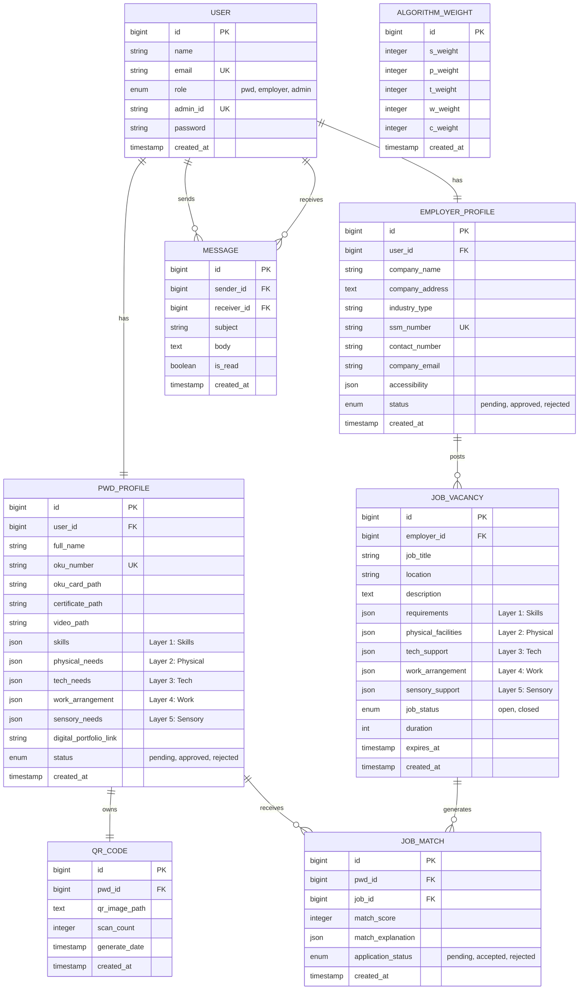

# AbilityScan - Updated Entity-Relationship Diagram (ERD)

This document contains the updated ERD for the **AbilityScan** system, reflecting the removal of the email verification column (`email_verified_at`) and matching your system's database schema.

---

## 1. Visual ERD (Mermaid Diagram)

You can copy and render this diagram directly in markdown tools:

---

## 2. Table Specifications

### User
*   **Primary Key (PK):** `id` (bigint)
*   **Unique Keys (UK):** `email`, `admin_id`
*   **Attributes:**
    *   `name` (string)
    *   `email` (string)
    *   `role` (enum: `pwd`, `employer`, `admin`)
    *   `admin_id` (string, nullable)
    *   `password` (string)
    *   `created_at` (timestamp)
*   **Relationships:**
    *   One-to-One (`1:1`) with `PWD_Profile`
    *   One-to-One (`1:1`) with `Employer_Profile`
    *   One-to-Many (`1:N`) with `Message` (as Sender and Receiver)

### PWD_Profile
*   **Primary Key (PK):** `id` (bigint)
*   **Foreign Key (FK):** `user_id` (bigint, references `users.id`)
*   **Unique Keys (UK):** `oku_number`
*   **Attributes:**
    *   `full_name` (string)
    *   `oku_number` (string)
    *   `oku_card_path` (string, for card uploads)
    *   `certificate_path` (string, nullable)
    *   `video_path` (string, nullable)
    *   `skills` (json, Layer 1)
    *   `physical_needs` (json, Layer 2)
    *   `tech_needs` (json, Layer 3)
    *   `work_arrangement` (json, Layer 4)
    *   `sensory_needs` (json, Layer 5)
    *   `digital_portfolio_link` (string, nullable)
    *   `status` (enum: `pending`, `approved`, `rejected`)
    *   `created_at` (timestamp)
*   **Relationships:**
    *   One-to-One (`1:1`) with `QR_Code`
    *   One-to-Many (`1:N`) with `Job_Match`

### Employer_Profile
*   **Primary Key (PK):** `id` (bigint)
*   **Foreign Key (FK):** `user_id` (bigint, references `users.id`)
*   **Unique Keys (UK):** `ssm_number`
*   **Attributes:**
    *   `company_name` (string)
    *   `company_address` (text)
    *   `industry_type` (string)
    *   `ssm_number` (string)
    *   `contact_number` (string)
    *   `company_email` (string)
    *   `accessibility` (json, nullable)
    *   `status` (enum: `pending`, `approved`, `rejected`)
    *   `created_at` (timestamp)
*   **Relationships:**
    *   One-to-Many (`1:N`) with `Job_Vacancy`

### Job_Vacancy
*   **Primary Key (PK):** `id` (bigint)
*   **Foreign Key (FK):** `employer_id` (bigint, references `employer_profiles.id`)
*   **Attributes:**
    *   `job_title` (string)
    *   `location` (string)
    *   `description` (text, nullable)
    *   `requirements` (json, Layer 1)
    *   `physical_facilities` (json, Layer 2)
    *   `tech_support` (json, Layer 3)
    *   `work_arrangement` (json, Layer 4)
    *   `sensory_support` (json, Layer 5)
    *   `job_status` (enum: `open`, `closed`)
    *   `duration` (integer, nullable)
    *   `expires_at` (timestamp, nullable)
    *   `created_at` (timestamp)
*   **Relationships:**
    *   One-to-Many (`1:N`) with `Job_Match`

### Job_Match
*   **Primary Key (PK):** `id` (bigint)
*   **Foreign Keys (FK):**
    *   `pwd_id` (bigint, references `pwd_profiles.id`)
    *   `job_id` (bigint, references `job_vacancies.id`)
*   **Attributes:**
    *   `match_score` (integer)
    *   `match_explanation` (json, details of calculations)
    *   `application_status` (enum: `pending`, `accepted`, `rejected`)
    *   `created_at` (timestamp)

### QR_Code
*   **Primary Key (PK):** `id` (bigint)
*   **Foreign Key (FK):** `pwd_id` (bigint, references `pwd_profiles.id`)
*   **Attributes:**
    *   `qr_image_path` (text, nullable)
    *   `scan_count` (integer)
    *   `generate_date` (timestamp, nullable)
    *   `created_at` (timestamp)

### Message
*   **Primary Key (PK):** `id` (bigint)
*   **Foreign Keys (FK):**
    *   `sender_id` (bigint, references `users.id`)
    *   `receiver_id` (bigint, references `users.id`)
*   **Attributes:**
    *   `subject` (string, nullable)
    *   `body` (text)
    *   `is_read` (boolean)
    *   `created_at` (timestamp)

### Algorithm_Weight
*   **Primary Key (PK):** `id` (bigint)
*   **Attributes:**
    *   `s_weight` (integer)
    *   `p_weight` (integer)
    *   `t_weight` (integer)
    *   `w_weight` (integer)
    *   `c_weight` (integer)
    *   `created_at` (timestamp)
